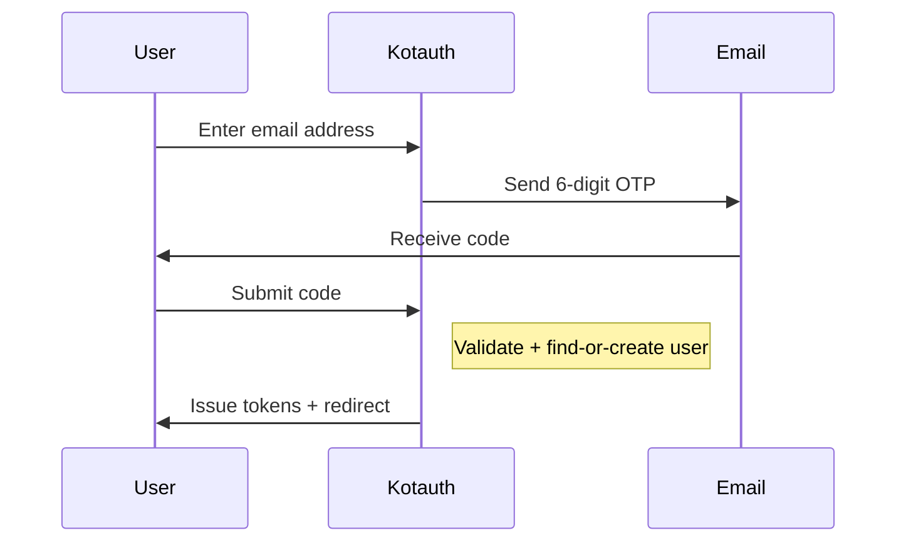

import { Aside } from '@astrojs/starlight/components';

Kotauth supports passwordless authentication via email one-time passwords (OTP). Users enter their email address, receive a 6-digit code, and submit it to authenticate — no password required.

Email OTP is available through both the hosted login page and a standalone Admin API for headless integrations.

## How it works



1. The user enters their email address on the OTP login page (or the API client calls `send-otp`).
2. Kotauth generates a cryptographically random 6-digit code, hashes it with SHA-256, and stores the hash alongside a challenge ID.
3. The code is delivered via the workspace's configured SMTP.
4. The user submits the code. If valid and unexpired, Kotauth authenticates the user and issues an authorization code.
5. If no account exists for that email and self-registration is enabled, Kotauth creates one automatically.

## Hosted login flow

The hosted login page is available at:

```
/t/{slug}/email-otp
```

The flow consists of two screens — an email entry page and a code verification page. A short-lived encrypted cookie ties the challenge to the browser session.

Users can click **Resend code** to get a new code. Resending invalidates any previously issued code for the same challenge.

<Aside type="note">
The Email OTP login option appears on the Kotauth login page only when the workspace has SMTP configured and the feature is enabled in workspace settings.
</Aside>

## Admin API

For headless integrations (mobile apps, custom frontends), use the Admin API endpoints directly.

### Send OTP

```http
POST /t/{slug}/api/v1/auth/send-otp
Content-Type: application/json

{
  "email": "alice@example.com",
  "originatingClientId": "my-spa"
}
```

| Field | Required | Description |
|---|---|---|
| `email` | Yes | The user's email address |
| `originatingClientId` | No | The OAuth client initiating the flow. Used to apply client default roles on account creation. |

**Response `202 Accepted`:**

```json
{
  "challengeId": "abc123...",
  "expiresAt": "2026-06-17T12:10:00Z"
}
```

The response is intentionally uniform regardless of whether the email exists — this prevents user enumeration.

### Verify OTP

```http
POST /t/{slug}/api/v1/auth/verify-otp
Content-Type: application/json

{
  "challengeId": "abc123...",
  "otp": "482917"
}
```

| Field | Required | Description |
|---|---|---|
| `challengeId` | Yes | The challenge ID from the send-otp response |
| `otp` | Yes | The 6-digit code (string, must match `\d{6}`) |

**Response `200 OK`:**

```json
{
  "authorizationCode": "code_xyz...",
  "expiresAt": "2026-06-17T12:01:00Z",
  "redirectUri": "https://app.example.com/callback"
}
```

The authorization code has a 60-second TTL and is exchanged for tokens via the standard [Token Endpoint](/oidc/token/).

---

## Find-or-create semantics

When an OTP is verified for an email address that does not match any existing user:

- **If self-registration via OTP is enabled** — Kotauth creates a new account automatically. The user is assigned a generated username derived from the email prefix. The account has no password (internally stored with a sentinel hash). Client default roles from `originatingClientId` are applied if configured.
- **If self-registration is disabled** — the OTP verification fails silently. The response during the send phase remains identical to prevent enumeration.

Users created via Email OTP can later set a password through the self-service portal if the workspace allows password login.

---

## Security

### Code properties

| Property | Value |
|---|---|
| Code length | 6 digits |
| Entropy | ~20 bits (0–999999) |
| Hashing | SHA-256 (raw code never stored) |
| Expiry | 10 minutes |
| Max attempts per challenge | 5 |

### Rate limiting

Email OTP has dedicated rate-limit buckets separate from password login:

- **Per-email**: limits how frequently codes can be sent to a single address
- **Per-IP**: limits total OTP requests from a single IP address

All responses include constant-time padding (800ms for API, 200ms for hosted login) to prevent timing-based user enumeration.

### Cross-challenge lockout

Failed OTP attempts are tracked per user across challenges. If a user accumulates failures across multiple challenges up to the workspace's `emailOtpLockoutThreshold`, the account is locked for the configured `lockoutDurationMinutes`. A locked-account notification email is sent.

This prevents an attacker from circumventing per-challenge limits by requesting new challenges repeatedly.

### Resend behavior

Clicking "Resend code" on the hosted page (or calling `send-otp` again) generates a fresh code and invalidates any previous unconsumed challenge for the same email. Only the latest code is valid.

### MFA interaction

If the user has MFA enrolled and the workspace MFA policy requires it, the MFA challenge is presented after OTP verification — Email OTP does not bypass MFA.

---

## Workspace configuration

Email OTP settings are managed in the admin console under **Settings → Authentication**:

| Setting | Description |
|---|---|
| Email OTP enabled | Toggle the Email OTP login method on/off |
| Allow self-registration via OTP | Create accounts automatically for unknown emails |
| Lockout threshold | Number of failed OTP attempts before account lockout |
| Lockout duration | How long the account stays locked (minutes) |

<Aside type="caution">
Email OTP requires SMTP to be configured for the workspace. Without it, codes cannot be delivered and the feature is effectively disabled.
</Aside>
