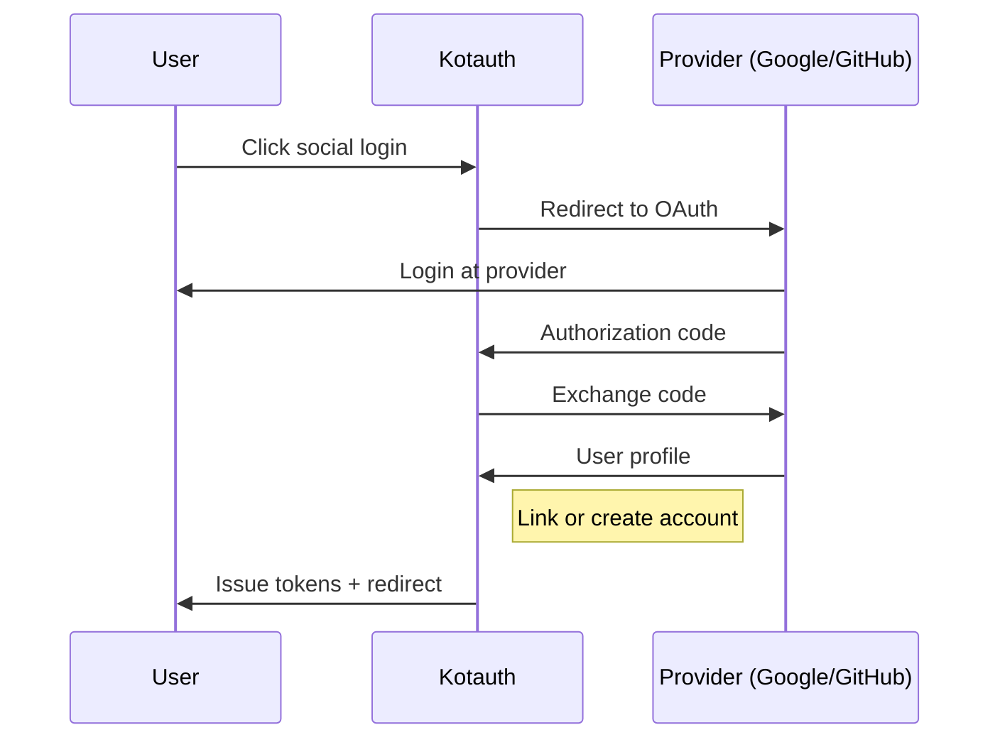

import { Aside } from '@astrojs/starlight/components';

Kotauth supports social login via **Google** and **GitHub**. When a user clicks a social provider button on the Kotauth login page, Kotauth handles the OAuth2 exchange with the provider and either links the account to an existing user or creates a new one.

Your application's integration code does not change — you still use the standard Authorization Code flow with Kotauth. Social login is transparent to your app.

## How it works



## Account linking

When a user authenticates via a social provider, Kotauth matches the provider's email against existing users in the workspace:

- **Email match found** — the social identity is linked to the existing account. The user can now log in with either their password or the social provider.
- **No match** — a new account is created. If the provider's email is not available, Kotauth prompts the user to choose a username to complete registration.

<Aside type="note">
Account linking is automatic based on email address. If you need to prevent automatic linking (e.g. for security reasons in your workspace), raise a GitHub issue — this will be configurable in a future release.
</Aside>

## Configuring social providers

Social providers are configured **per workspace** in the admin console. They are not global — each workspace controls which providers its users can use.

### Google

1. Go to [Google Cloud Console](https://console.cloud.google.com/) → **APIs & Services → Credentials**
2. Create an **OAuth 2.0 Client ID** of type **Web application**
3. Add the Kotauth callback URL as an authorized redirect URI:
   ```
   https://auth.yourdomain.com/t/{slug}/auth/social/google/callback
   ```
4. Copy the **Client ID** and **Client Secret**
5. In the Kotauth admin console, go to **Settings → Social Login** and enter the credentials

### GitHub

1. Go to [GitHub Developer Settings](https://github.com/settings/developers) → **OAuth Apps → New OAuth App**
2. Set the **Authorization callback URL** to:
   ```
   https://auth.yourdomain.com/t/{slug}/auth/social/github/callback
   ```
3. Copy the **Client ID** and generate a **Client Secret**
4. In the Kotauth admin console, go to **Settings → Social Login** and enter the credentials

<Aside type="caution">
Social login requires HTTPS. Kotauth will refuse to initiate the OAuth2 flow with providers if `KAUTH_BASE_URL` does not start with `https://`. This matches the requirements of both Google and GitHub's OAuth2 policies.
</Aside>

## What's included in the user profile

When a user authenticates via a social provider, Kotauth fetches their profile and populates:

| Field | Source |
|---|---|
| `email` | Provider's verified email |
| `fullName` | Provider's display name |
| `username` | Provider's login/username (or user-chosen if unavailable) |
| `emailVerified` | Set to `true` — provider-verified emails are trusted |

## Connected accounts in the portal

Users can view their linked social identities from the self-service portal under their **Profile** page. The "Connected accounts" section displays each linked provider (Google, GitHub) with the provider icon and associated email. Users who signed in only with a password see an empty state.

## Social login and MFA

If the workspace MFA policy is `required` or `required_for_admins`, users who log in via a social provider are still required to complete MFA enrollment. Social login does not bypass MFA policies.
