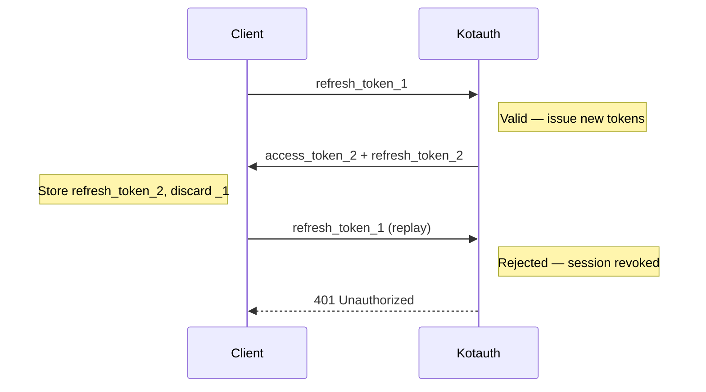

import { Aside } from '@astrojs/starlight/components';

Understanding how tokens work in Kotauth prevents a class of subtle integration bugs and security issues. This page covers what each token is, how long it lives, and what happens when it's rotated or revoked.

## Token types

### Access token

A short-lived RS256-signed JWT. Resource servers verify it using the workspace JWKS endpoint — no call to Kotauth per request.

**Default lifetime:** 300 seconds (5 minutes). Configurable per application in the admin console.

**Contents:**

```json
{
  "iss": "https://auth.yourdomain.com/t/my-app",
  "sub": "42",
  "aud": ["my-spa"],
  "exp": 1735689600,
  "iat": 1735689300,
  "name": "Alice Smith",
  "email": "alice@example.com",
  "email_verified": true,
  "preferred_username": "alice",
  "realm_access": {
    "roles": ["admin"]
  },
  "resource_access": {
    "my-spa": {
      "roles": ["orders:write"]
    }
  }
}
```

Access tokens are **not** stored in the Kotauth database. Once issued, they are verified purely by JWT signature. Revoking access requires waiting for expiry or accepting a short window of continued access (the token lifetime).

### Refresh token

A long-lived opaque token. Only meaningful to Kotauth — resource servers never see it. Stored in the database as a SHA-256 hash.

**Default lifetime:** 86400 seconds (24 hours). Configurable per workspace.

Used to obtain a new access token without re-authenticating. Returns a new access token **and** a new refresh token on every use (rotation).

### ID token

A JWT issued alongside the access token during OIDC flows. Contains user identity claims. Intended for the **client application**, not resource servers. Use it to display user info in your UI, not to protect API endpoints.

## Token rotation

Refresh tokens rotate on every use. When you exchange a refresh token for a new access token, you get a new refresh token in the response. The previous refresh token is immediately invalidated.



<Aside type="caution">
If a refresh token is used after rotation, Kotauth treats this as a token theft signal and **revokes the entire session**. All active tokens for that session stop working immediately. The user must re-authenticate.

This means your application must never use a refresh token more than once and must never allow concurrent refresh attempts for the same token.
</Aside>

## Expiry configuration

These settings live in the admin console per workspace (or per application for access token TTL):

| Setting | Default | Notes |
|---|---|---|
| Access token TTL | 300s (5 min) | Configurable per application |
| Refresh token TTL | 86400s (24h) | Workspace-wide |
| Email verification token | 24h | Fixed |
| Password reset token | 1h | Fixed |

## Session revocation

A session is the server-side record associated with a refresh token. Revoking a session:

- Invalidates the refresh token immediately
- Does **not** immediately invalidate in-flight access tokens (they are stateless JWTs)
- Prevents issuance of any new tokens for that session

Sessions can be revoked by:

- The user from the self-service portal (`/t/{slug}/account/sessions`)
- An admin from the admin console or REST API (`DELETE /sessions/{id}`)
- The logout endpoint (`/t/{slug}/protocol/openid-connect/logout`)
- Replay detection (automatic, as described above)

## Verifying tokens on resource servers

Resource servers should validate:

1. **Signature** — using the JWKS endpoint (`/t/{slug}/protocol/openid-connect/certs`)
2. **`exp` claim** — token has not expired
3. **`iss` claim** — matches your expected issuer (`https://auth.yourdomain.com/t/{slug}`)
4. **`aud` claim** — contains your application's client ID

Most OAuth2 libraries handle all four checks when given the OIDC discovery URL.

## Token introspection

If your resource server cannot verify JWTs locally (uncommon, but possible with opaque tokens or when you need real-time revocation checks), use the introspection endpoint:

```http
POST /t/{slug}/protocol/openid-connect/introspect
Authorization: Basic base64(client_id:client_secret)
Content-Type: application/x-www-form-urlencoded

token=ACCESS_TOKEN&token_type_hint=access_token
```

See [Introspection & Revocation](/oidc/introspection-revocation/) for details.
