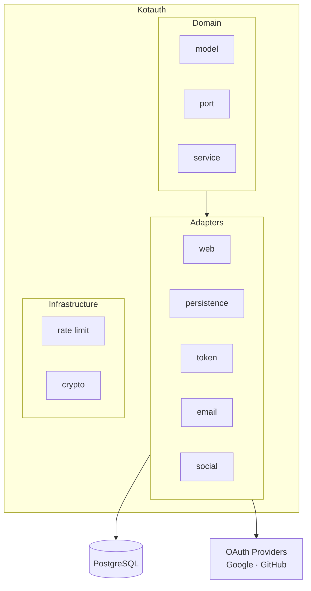

Kotauth is an open-source identity and authentication platform designed for teams that need full control over their auth infrastructure without the operational weight of enterprise IAM systems or the vendor lock-in of SaaS solutions.

It bridges the gap between complexity (Keycloak, Okta) and convenience (Clerk, Auth0) — giving you a spec-compliant OAuth2 / OIDC provider that runs in a single Docker container, manages its own database schema, and is ready to accept connections in minutes.

## What Kotauth provides

**OAuth2 and OIDC compliance.** Kotauth implements the Authorization Code flow with PKCE, the Client Credentials flow, refresh token rotation, token introspection (RFC 7662), token revocation (RFC 7009), and a full OIDC discovery document with per-tenant JWKS endpoints. Any library or framework that speaks standard OAuth2/OIDC works with Kotauth out of the box.

**Multi-tenancy.** A single Kotauth instance hosts multiple independent workspaces. Each workspace has its own isolated user directory, OAuth applications, role definitions, SMTP configuration, and RS256 signing key pair. Users in workspace A cannot interact with workspace B in any way.

**REST API.** A machine-to-machine API covers the full lifecycle of users, roles, groups, OAuth applications, sessions, and audit logs. Each operation is guarded by API key scopes so you can issue keys with the minimum privilege required.

**Role-based access control.** Roles can be scoped to the entire workspace (tenant roles) or to a specific application (client roles). Groups provide a hierarchy layer — users inherit all roles assigned to their groups and parent groups. Access token JWT claims expose these as `realm_access.roles` and `resource_access.<clientId>.roles`.

**Webhooks.** Subscribe any endpoint URL to identity events — `user.created`, `login.failed`, `session.revoked`, and five others. Payloads are signed with HMAC-SHA256 (`X-KotAuth-Signature`) and delivered asynchronously with automatic retries (immediate → 5 min → 30 min). Your application reacts to auth events in real time without polling.

**White-label auth pages.** Every workspace ships with a fully themeable login, registration, and MFA flow. Override colors, border radius, logo, and favicon per workspace through the admin console or the REST API. CSS custom properties are injected server-side at render time — no rebuild required.

**Built-in admin console.** A full web UI for workspace management, user administration, application setup, audit log review, webhook configuration, and security policies. No separate tooling required for day-to-day operations.

**User invitations.** Admins can invite users via branded email instead of setting passwords on their behalf. Invited users receive a secure activation link (72-hour expiry), set their own password, and their account activates automatically. A required actions framework tracks pending setup steps like `SET_PASSWORD`, with purpose-scoped tokens ensuring invite and password-reset flows never interfere with each other.

**Self-service user portal.** Users can manage their own profile, change passwords, view and revoke active sessions, enroll in or disable MFA, and view connected social accounts (Google, GitHub) — without developer involvement.

**AI-native management (MCP).** The [`@kotauth/mcp`](/mcp/overview) package connects AI assistants like Claude and Cursor directly to your Kotauth instance via the Model Context Protocol. 21 tools let you manage users, roles, groups, applications, sessions, and audit logs through natural language — no HTTP requests, no SDK, no code.

## How Kotauth compares

| | Kotauth | Keycloak | Clerk / Auth0 |
|---|---|---|---|
| **Self-hosted** | Yes | Yes | No |
| **Docker-native** | Yes | Complicated | N/A |
| **Multi-tenant** | Yes | Realm-based | Organization-based |
| **OIDC compliant** | Yes | Yes | Yes |
| **REST management API** | Yes | Yes | Yes |
| **AI assistant integration (MCP)** | Yes | No | No |
| **User invitations** | Yes | Yes | Yes |
| **Setup time** | ~2 min | ~30 min | ~5 min |
| **Operational footprint** | Minimal | Heavy (JVM, Infinispan) | Zero |
| **Open source** | MIT | Apache 2.0 | Closed |

## Architecture at a glance

Kotauth is built on Kotlin with the Ktor framework and PostgreSQL. It follows hexagonal architecture — the domain layer has zero framework dependencies and all I/O flows through typed port interfaces. This makes the codebase straightforward to extend and the business logic easy to test in isolation.

## Next steps

- [Quickstart](/getting-started/quickstart/) — get a local instance running in under 5 minutes
- [Core Concepts](/getting-started/core-concepts/) — understand workspaces, applications, and tokens
- [Authentication Overview](/authentication/overview/) — understand the supported auth flows
- [User Invitations](/authentication/user-invitations/) — onboard users via branded invite emails
- [Webhooks](/customization/webhooks/) — react to identity events in real time
- [White-label Theming](/customization/theming/) — apply your brand to auth pages
