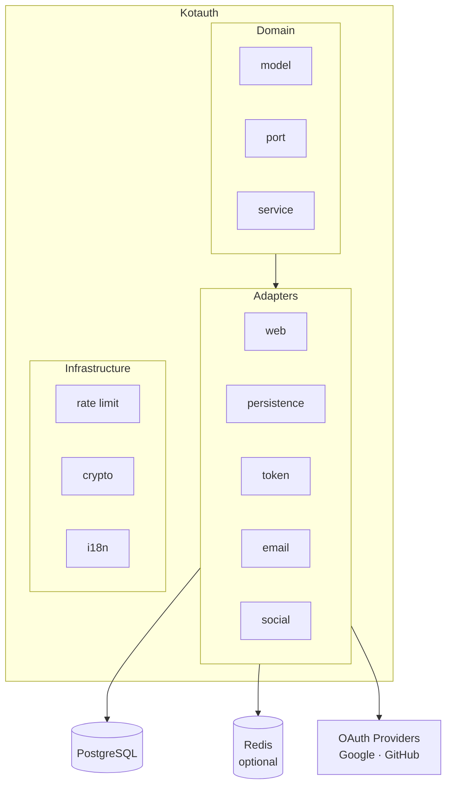

Kotauth is an open-source identity and authentication platform designed for teams that need full control over their auth infrastructure without the operational weight of enterprise IAM systems or the vendor lock-in of SaaS solutions.

It bridges the gap between complexity (Keycloak, Okta) and convenience (Clerk, Auth0) — giving you a spec-compliant OAuth2 / OIDC provider that runs in a single Docker container, manages its own database schema, and is ready to accept connections in minutes.

## What Kotauth provides

**OAuth2 and OIDC compliance.** Kotauth implements the Authorization Code flow with PKCE, the Client Credentials flow, refresh token rotation, token introspection (RFC 7662), token revocation (RFC 7009), and a full OIDC discovery document with per-tenant JWKS endpoints. Any library or framework that speaks standard OAuth2/OIDC works with Kotauth out of the box.

**Multi-tenancy.** A single Kotauth instance hosts multiple independent workspaces. Each workspace has its own isolated user directory, OAuth applications, role definitions, SMTP configuration, and RS256 signing key pair with admin-initiated key rotation. Signing keys can be rotated from the admin console with zero-downtime rollover — old keys remain in JWKS for token verification until explicitly retired. Users in workspace A cannot interact with workspace B in any way.

**REST API.** A machine-to-machine API covers the full lifecycle of users, roles, groups, OAuth applications, sessions, and audit logs. Each operation is guarded by API key scopes so you can issue keys with the minimum privilege required.

**Role-based access control.** Roles can be scoped to the entire workspace (tenant roles) or to a specific application (client roles). Groups provide a hierarchy layer — users inherit all roles assigned to their groups and parent groups. Access token JWT claims expose these as `realm_access.roles` and `resource_access.<clientId>.roles`.

**Webhooks.** Subscribe any endpoint URL to identity events — `user.created`, `login.failed`, `session.revoked`, and five others. Payloads are signed with HMAC-SHA256 (`X-KotAuth-Signature`) and delivered asynchronously with automatic retries (immediate → 5 min → 30 min). Your application reacts to auth events in real time without polling.

**White-label auth pages.** Every workspace ships with a fully themeable login, registration, and MFA flow. Override colors, border radius, logo, and favicon per workspace through the admin console or the REST API. CSS custom properties are injected server-side at render time — no rebuild required.

**Built-in admin console.** A full web UI for workspace management, user administration, application setup, audit log review, webhook configuration, and security policies. No separate tooling required for day-to-day operations.

**User invitations.** Admins can invite users via branded email instead of setting passwords on their behalf. Invited users receive a secure activation link (72-hour expiry), set their own password, and their account activates automatically. A required actions framework tracks pending setup steps like `SET_PASSWORD`, with purpose-scoped tokens ensuring invite and password-reset flows never interfere with each other.

**Self-service user portal.** Users can manage their own profile, change passwords, view and revoke active sessions, enroll in or disable MFA, and view connected social accounts (Google, GitHub) — without developer involvement.

**Custom JWT claims.** Attach per-user key-value attributes and project them into JWT access and/or ID tokens using tenant-level claim mappers. 41 reserved OIDC claim names are protected. Changes propagate on next token issuance or immediately on refresh token renewal.

**Magic-link passwordless.** Users can authenticate via email with 15-minute one-time tokens — no password required. Same-device cookie binding prevents token replay from a different browser. MFA is still enforced if enrolled. Workspaces can disable password login entirely to go fully passwordless.

**Email OTP passwordless.** A second passwordless method using 6-digit one-time codes delivered via email. Codes expire after 10 minutes, are SHA-256 hashed at rest, and are limited to 5 attempts per challenge. Find-or-create semantics automatically provision accounts for unknown emails when self-registration is enabled. Cross-challenge lockout tracks failures across multiple OTP challenges to prevent brute-force attempts. Available via the hosted login page and as a headless Admin API (`send-otp` / `verify-otp`).

**Admin impersonation.** Administrators can act as any user without knowing their password. Impersonated sessions carry an RFC 8693 `act` claim for full audit attribution. A dual-session model preserves the admin session underneath, and cascade revocation ensures impersonated sessions are terminated when the admin logs out.

**Tenant backup & restore.** Export entire workspaces as encrypted, portable archive files (PBKDF2 600k iterations + AES-256-GCM) via CLI or admin API. Import with schema-version compatibility validation. Useful for disaster recovery, environment promotion, and migration between instances.

**Redis distributed sessions.** An optional Redis sidecar upgrades in-memory session storage and rate limiting to distributed implementations. Lua-scripted rate limiting ensures consistent enforcement across all instances. Fail-closed semantics prevent security bypass during Redis outages.

**Internationalization (i18n).** All user-facing strings in auth pages and the portal are externalized through a translation system. Volume-mounted JSON bundles let you add languages without recompiling. Accept-Language header resolution with quality-factor ranking and configurable per-workspace default locale.

**App launcher.** A per-workspace tile grid at `/t/{slug}/launcher` shows all applications the user is entitled to access, based on client-scoped roles. Tiles are auto-generated from registered OAuth applications.

**Breached password detection.** Passwords are checked against the Have I Been Pwned database using k-Anonymity range queries during registration and password changes. Only the first 5 characters of the SHA-1 hash leave the server.

**Transactional email branding.** Each workspace can customize the appearance of outbound emails — brand name, accent color, logo, support email, and sender display name. Branding overrides cascade from workspace-specific values to theme defaults to SMTP configuration. The envelope sender address stays operator-controlled for DKIM/SPF/DMARC alignment.

**Client default roles.** Applications can define a set of roles that are automatically assigned to users at self-registration. When a user signs up through a specific OAuth client (password, social login, or Email OTP), the application's default roles are applied. Managed via REST API (`GET`/`PUT /applications/{appId}/default-roles`).

**Custom token audience.** Each application can specify a custom `aud` claim for its JWTs, separate from the `client_id`. The resolution order is: `application.audience` → `application.clientId` → `tenant.slug`. This is useful when resource servers expect a specific audience value.

**Bootstrap API keys.** The `KAUTH_BOOTSTRAP_API_KEYS` environment variable accepts a JSON array of pre-provisioned API keys. Keys are upserted idempotently on startup — existing keys are updated if their hash or scopes changed, and new keys are created. Invalid tenant slugs or unknown scopes cause a fatal startup error. Useful for infrastructure-as-code and automated provisioning.

**Silent SSO.** OIDC `prompt=none` checks for existing sessions without user interaction. `max_age` enforces re-authentication after a specified duration. `id_token_hint` validates session identity. The `auth_time` claim lets clients verify session age independently.

**AI-native management (MCP).** The [`@kotauth/mcp`](/mcp/overview) package connects AI assistants like Claude and Cursor directly to your Kotauth instance via the Model Context Protocol. 33 tools let you manage users, roles, groups, applications, sessions, audit logs, user attributes, and claim mappers through natural language — no HTTP requests, no SDK, no code.

## How Kotauth compares

| | Kotauth | Keycloak | Clerk / Auth0 |
|---|---|---|---|
| **Self-hosted** | Yes | Yes | No |
| **Docker-native** | Yes | Complicated | N/A |
| **Multi-tenant** | Yes | Realm-based | Organization-based |
| **OIDC compliant** | Yes | Yes | Yes |
| **REST management API** | Yes | Yes | Yes |
| **Magic-link passwordless** | Yes | No | Yes |
| **Email OTP passwordless** | Yes | No | Yes |
| **Client default roles** | Yes | Yes | Yes |
| **Transactional email branding** | Yes | Yes | Yes |
| **Refresh-token replay detection** | Yes | Yes | N/A |
| **TOTP replay + lockout** | Yes | Yes | N/A |
| **Non-root container** | Yes | Yes | N/A |
| **Bootstrap API keys (env-managed)** | Yes | No | No |
| **AI assistant integration (MCP)** | Yes | No | No |
| **Tenant backup & restore** | Yes | No | No |
| **Admin impersonation** | Yes | Yes | Yes |
| **Silent SSO (prompt=none)** | Yes | Yes | Yes |
| **Redis distributed sessions** | Yes | Yes | N/A |
| **Internationalization** | Yes | Yes | Yes |
| **Breached password detection** | Yes | No | Yes |
| **User invitations** | Yes | Yes | Yes |
| **Custom JWT claims** | Yes | Yes (protocol mappers) | Yes |
| **Setup time** | ~2 min | ~30 min | ~5 min |
| **Operational footprint** | Minimal | Heavy (JVM, Infinispan) | Zero |
| **Open source** | MIT | Apache 2.0 | Closed |

## Architecture at a glance

Kotauth is built on Kotlin 2.3 with Ktor 3.4 and PostgreSQL, with an optional Redis sidecar for distributed deployments. It follows hexagonal architecture — the domain layer has zero framework dependencies and all I/O flows through typed port interfaces. Route handling uses Ktor's route-scoped plugin system for tenant resolution, session guards, and API context injection. This makes the codebase straightforward to extend and the business logic easy to test in isolation.

```mermaid
graph TB
    subgraph Kotauth
        subgraph Domain
            M[model]
            P[port]
            S[service]
        end
        subgraph Adapters
            W[web]
            DB[persistence]
            T[token]
            E[email]
            SO[social]
        end
        subgraph Infrastructure
            R[rate limit]
            C[crypto]
            I[i18n]
        end
    end

    Domain --> Adapters
    Adapters --> PG[(PostgreSQL)]
    Adapters --> RD[(Redis<br/>optional)]
    Adapters --> OP[OAuth Providers<br/>Google · GitHub]
```

## Next steps

- [Quickstart](/getting-started/quickstart/) — get a local instance running in under 5 minutes
- [Core Concepts](/getting-started/core-concepts/) — understand workspaces, applications, and tokens
- [Authentication Overview](/authentication/overview/) — understand the supported auth flows
- [Magic-Link Passwordless](/authentication/magic-links/) — email-based passwordless login
- [Email OTP Passwordless](/authentication/email-otp/) — 6-digit code passwordless login with find-or-create
- [User Invitations](/authentication/user-invitations/) — onboard users via branded invite emails
- [Custom JWT Claims](/authentication/custom-claims/) — project per-user attributes into access and ID tokens
- [Admin Impersonation](/authentication/impersonation/) — act as any user for debugging and support
- [Email Branding](/customization/email-branding/) — customize transactional email appearance per workspace
- [Backup & Restore](/deployment/backup-restore/) — encrypted tenant export and import
- [Redis](/deployment/redis/) — distributed sessions and rate limiting
- [Key Rotation](/deployment/key-rotation/) — rotate signing keys with zero-downtime rollover
- [Internationalization](/customization/i18n/) — translate auth pages and the portal
- [Webhooks](/customization/webhooks/) — react to identity events in real time
- [White-label Theming](/customization/theming/) — apply your brand to auth pages
