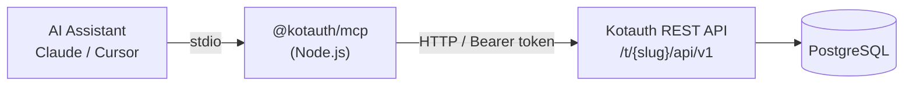

The `@kotauth/mcp` package is an MCP server that connects AI assistants — Claude, Cursor, Windsurf, and any other MCP-compatible client — directly to your Kotauth instance. It exposes 21 tools across 6 domains, letting you manage users, roles, groups, applications, sessions, and audit logs through natural language.

Instead of writing HTTP requests or navigating the admin console, you describe what you want and the AI assistant calls the right Kotauth API endpoints automatically.

## What is MCP?

The [Model Context Protocol](https://modelcontextprotocol.io/) is an open standard that lets AI assistants interact with external systems through typed tools. An MCP server declares a set of tools with parameter schemas — the AI assistant reads those schemas and decides which tools to call based on your request.

Kotauth's MCP server wraps the [REST API v1](/api/overview) so that every operation available through the API is also available through natural language.

## What you can do

With `@kotauth/mcp` connected, you can ask your AI assistant to:

- **Create and manage users** — provision accounts, update profiles, disable users, assign roles
- **Configure RBAC** — create roles with tenant or client scope, build group hierarchies, manage membership
- **Manage OAuth applications** — list registered clients, update redirect URIs, change access types
- **Monitor sessions** — list active sessions with IP addresses and expiry times, revoke individual sessions
- **Query audit logs** — filter by event type, user, and time range to investigate activity

All operations respect the same scope-based access control as the REST API. An API key with `users:read` scope can list users but not create them.

## Architecture

The MCP server runs as a local process on your machine. It communicates with the AI assistant over stdio (standard input/output) and with your Kotauth instance over HTTP using a scoped API key. No data flows through third-party servers — the MCP server talks directly to your Kotauth deployment.

<Aside type="tip">
The MCP server is a thin wrapper around the REST API. Every operation it performs could be done with `curl` — MCP just removes the need to remember endpoints, parameters, and authentication headers.
</Aside>

## Requirements

- **Node.js 18+** (for running the MCP server)
- **A running Kotauth instance** (local or remote)
- **An API key** with the scopes you need (created in the admin console under Settings → API Keys)

## Next steps

- [Setup & Configuration](/mcp/setup) — install the MCP server and connect it to Claude, Cursor, or any MCP client
- [Tool Reference](/mcp/tools) — full list of all 21 tools with parameters and required scopes
- [Examples & Recipes](/mcp/examples) — common workflows and prompts
